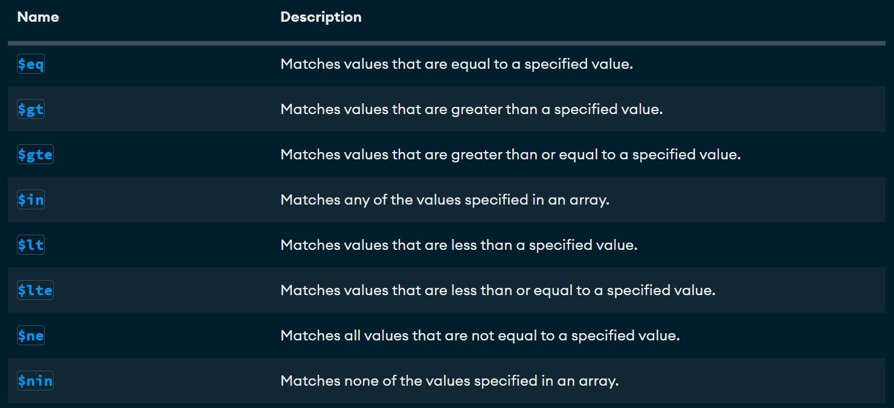

# MongoDB Crud

## Crear una base de datos

*Solo se crea si contiene por lo menos una coleccion*

```json
use basededatos
```


## Crear una coleccion

```json
use db1
db.createCollection('Empleado')
```

## Mostrar Colleciones
show collections

## Insercion de un documento
```json
db.Empleado.insertOne(
    {
    nombre: 'Soyla',
    apellido: 'Vaca',
    edad: 32,
    ciudad: 'San Miguel de las piedras'
    }
)
```
## Insercion de un documento mas complejo con array

```json
db.Empleado.insertOne({
    nombre: 'Ivan',
    apellido: 'Baltazar',
    apellido2: 'Rodriguez',
    aficiones: ['Cerveza', 'Canabis', 'Crico', 'Mentir']
})
```

*Eliminar una coleccion*
```json
db.coleccion.drop()
```

_Ejemplo_
```json
db.Empleado.drop()
```


## Insercion de documentos mas complejos con anidados, arrays y ID

```json
db.alumnos.insertOne({
    nombre: 'Jose Luis',
    apellido: 'Herrera',
    apellido2: 'Gallardo',
    edad: 41,
    estudios:[
        'Ingenieria en Sistemas Computacionales',
        'Maestria en Administracion de Tecnologias de Informacion'
    ],
    experiencias: {
        lenguaje: 'SQL',
        sgb: 'SqlServer',
        anios_experiencia: 20
    }
})


json

db.alumnos.insertOne({
    _id: 3,
    nombre: 'Sergio',
    apellido: 'Ramos',
    equipo: 'Monterrey',
    aficiones: ['Dinero', 'Hombres', 'Fiesta'],
    talentos:{
        futbol: true,
        baniarse: false
    }
})
```

## Insertar Multiples Documentos
```json
db.alumnos.insertMany(
[
    {
        _id: 12,
        nombre: 'Oswaldo',
        apellido: 'Venado',
        edad: 20,
        descripcion: 'Es un quejumbroso'
    },
    {
        nombre: 'Maritza',
        apellido: 'Rechicken',
        edad: 20,
        habilidades:[
            'Ser Vibora', 'Ilusionar', 'Caguamear'],
        direccion: {
            calle: 'Del infierno',
            numero: 666
        },
        esposas:[
            {
                nombre: 'Joshua',
                edad: 20,
                pension: -34,
                hijos:['Ivan', 'Jose']
            },
            {
                nombre: 'Leo',
                edad: 15,
                pension: 70,
                complaciente: true
            }
        ]
    }
    
])
```

# Busquedas. Condiciones Simples de Igualdad Metodo find()

- 1. Seleccionar todos los documentos de la coleccion libros
```json
db.libros.find({})
```


- 2. Seleccionar todos los documentos que sean de la editoria biblio
```json
db.libros.find({editorial: 'Biblio'})
```


- 3. Mostrar todos los documentos que el precio sea 25
json
```json
db.libros.find({precio: 25})
```

- 4. Seleccionar todos los documentos donde el titulo sea
   'json para todos'

```json
db.libros.find({titulo: 'JSON para todos'})
```

## Operadores de comparacion

[Operadores de Comparacion](https://www.mongodb.com/docs/manual/reference/operator/query/)



- 1. Mostrar todos los documentos donde el precio sea mayor a 25
```json
db.libros.find({precio: {$gt:25}})
```
- 2. Mostrar los documentos donde el precio sea 25
```json
db.libros.find({precio: 25})

db.libros.find({precio: {$eq:25}})
```
- 3. Mostrar los documentos cuya cantidad sea menor a 5
```json
db.libros.find({cantidad: {$lt:5}})
```

- 4. Mostrar los documentos que pertenecen a la editorial biblio o planeta
```json
db.libros.find({editorial: { $in: ['Biblio', 'Planeta' ] }} )
```
- 5. Mostrar todos los documentos de libros que cuesten 20 o 25
```json
db.libros.find({precio: { $in: [20, 25 ] }} )
```
- 6. Recuperar todos los documentos que no cuesten 20 o 25
```json
db.libros.find({precio: { $nin: [20, 25 ] }} )
```
## Instruccion findOne

- 7. Recuperar solo una fila (Devuelve el primer elemento que cumpla la condicion)
```json
db.libros.findOne({precio: { $in: [20, 25 ] }} )
```
## Operadores Logicos

[Operadores Logicos](https://www.mongodb.com/docs/manual/reference/operator/query-logical/)

### Operador AND

- Dos posibles opciones

1. La simple, mediante condiciones separadas por comas.
```json
    - db.libros.find({condicion1, condicion2, ...}) -> con esto asume que es una and
```
2. Usando el operador $and
```json
        { $and: [ { <expression1> }, { <expression2> } , ... , { <expressionN> } ] }
    - db.libros.find({$and:[{condicion 1}, {condicion 2}]})
```
1. Mostrar todos aquellos libros que cuesten mas de 25 y cuya cantidad sea inferior a 15
```json
db.libros.find({precio: {$gt:25}, cantidad: {$lt: 15}})

db.libros.find({$and: [{precio: {$gt: 25}}, {cantidad: {$lt: 15}}]})
```
2. Mostrar todos aquellos libros que cuesten mas de 25 o cuya cantidad sea inferior a 15
```json
db.libros.find(
{
  $or:[
    {
      precio:{$gt:25}
    },
    {
      cantidad:{$lt:15}
    }
  ]
}
)
```

### Ejemplo con AND y OR Combinados

- Mostrar los libros de la editorial Biblio con precio mayor a 40 o libros de la editorial Planeta con precio mayor a 30
```json
db.libros.find(
{
  $and:[
    { $or: [ {editorial:'Biblio'}, {precio:{$gt:40}}]},
    { $or: [ {editorial:{$eq:'Planeta'}},{precio:{$gt:30}} ]}
  ]
}
)

db.libros.find(
{
  $and:[
    { $or: [ {editorial:'Biblio'}, {precio:{$gt:30}}]},
    { $or: [ {editorial:{$eq:'Planeta'}},{precio:{$gt:20}} ]}
  ]
}
)
```

### Proyeccion (ver ciertas columnas)

**Sintaxis**
```json
db.coleccion.find(filtro, columnas)
```
- 1. Seleccionar todos los libros, solo mostrando el titulo
```json
db.libros.find({},{ titulo: 1})
db.libros.find({},{ titulo: 1, _id:0})

db.getCollection('libros').find(
  { editorial: 'Planeta' },
  { _id: 0, titulo: 1, editorial: 1, precio: 1 }
);
```

### Operador exists (Permite saber si un campo se encuentra o no en un documento)
```json
{ field: { $exists: <boolean> } }

db.libros.find{{editorial:{$exists:true}}}
```

## Operador Type (Permite solicitar a mongodb si un campo corresponde a un tipo)

[Operador Type](https://www.mongodb.com/docs/manual/reference/operator/query/type/)

- Mostrar todos los documentos donde el precio sea de tipo double o entero o cualquier otro tipo de dato.

```json
db.libros.find({precio: {$type: 1}})

db.libros.find({precio: {$type: 'int'}})

db.libros.insertMany([{_id:12, titulo: 'IA', editorial: 'Terra', precio: 125, cantidad: 20}, {_id:13, titulo: 'Python para todos', editorial: 2001, precio: 200, cantidad: 30}])
```
- Seleccionar todos los documentos de libros donde los valores de la editorial sean string.
```json
db.libros.find({editorial: {$type: 2}})

db.libros.find({editorial: {$type: 'string'}})

db.libros.find({editorial: {$type: 16}})

db.libros.find({editorial: {$type: "int"}})
```

# Modificando Documentos
## Comandos Importantes
1. UpdateOne -> Modifica un solo documento
1. UpdateManu -> Modificar multiples documentos
1. replaceOne -> Sustituir el contenido completo de un documento

Tiene el siguiente formato
```json
db.collection.updateOne(
{filtro},
{operador:}
)
```

[Operadores Update](https://www.mongodb.com/docs/manual/reference/operator/update/)

**Operador $set**

1.Modificar un documento

```json
  db.libros.updateOne({titulo:'Python para todos'}, {$set:{titulo:'Java para Todos'}})


db.libros.insertOne(
{
    _id:10,
    titulo: 'Mongo en Negocios Digitales',
    editorial: 'Terra',
    precio: 125
}
)
```

- Modificar el documento con id 10, estableciendo el precio en 100 y la cantidad en 50
```json
db.libros.updateOne({_id:10}, {$set: {precio:100, cantidad:50}})
```

- Utilizando el updateMany, modificar todos los libros donde el precio es mayor a 100 cambiarlo por 150.
```json
 db.libros.updateMany(
 {
  precio:{$gt:100}
 },
 {
  $set:{precio:150}
 }
 )
```

## Operadores $inc y $mul

- Incrementar todos los precios de los libros en 5
```json
db.libros.updateMany(
{editorial: 'Terra'},
{
 $inc:{precio:5}
}
)
```

- Multiplicar todos los libros donde la cantidad sea mayor a 20, multiplicar la cantidad por 2 ($mul)
```json
db.libros.updateMany(
  {
    cantidad:{$gt:20}
  },
  {
  $mul:{
    cantidad:2
  }
  }
)
```

- Actualizar todos los libros multiplicando por 2 la cantidad y el precio de todos aquellos libros donde el precio sea mayor a 20
```json
db.libros.updateMany(
{
  precio:{$gt:20}
},
{
  $mul:{cantidad:2, precio:2}
}
)
```

## Reemplazar Documentos (replaceOne)

- Actualizar todo el documento del id 2 por el titulo de la tierra a la luna, autor julio verne, editorial Terra, precio 100
```json
db.libros.replaceOne(
  {_id:2},
  {
    titulo:'De la Tierra a la Luna',
    autor:'Julio Verne',
    editorial: 'Terra',
    precio: 100
  }
)

db.libros.replaceOne(
  {_id:2},
  {
    titulo:'La vida inutil de pito perez',
  }
)
```
## Borrar Documentos

1. deleteOne -> Elimina un solo documento
1. deleteMany -> Elimina multiples documentos

- Eliminar el documento con el id 2

```json
db.libros.deleteOne(
{_id:2}
)
```

- Eliminar todos los libros donde la cantidad es mayor a 150
```json
db.libros.deleteMany(
{
  cantidad:{$gt:150}
}
)
```

## Expresiones Regulares

- Seleccionar todos los libros que contengan en el titulo una t miniscula
```json
db.libros.find({titulo:/t/})
```

- Seleccionar todos los libros que en el titulo contenga la palabra json
```json
db.libros.find({titulo:/JSON/})
```

- Seleccionar todos los libros que en el titulo terminen con tos
```json
db.libros.find({titulo:/tos$/})
```

- Seleccionar todos los libros que en el titulo comienzen con j
```json
db.libros.find({titulo:/^J/})
```

## Operador $regex

[Operador Regex](https://www.mongodb.com/docs/manual/reference/operator/query/regex/)

- Seleccionar los libros que contengan la palabra ¨para¨

```json
db.libros.find(
  {
    titulo:{
      $regex:'para'
  }
 }
)


db.libros.find(
  {
    titulo:{
      $regex:/para/
  }
 }
)
```

- Seleccionar los libros que contengan la palabra ¨para¨

```json
db.libros.find(
  {
    titulo:{
      $regex:'JSON'
  }
 }
)

db.libros.find(
  {
    titulo:{
      $regex:/JSON/
  }
 }
)
```

- Distinguir entre mayusculas y minusculas

```json
db.libros.find(
  {
    titulo:{
      $regex:/json/i
  }
 }
)

db.libros.find(
 {
    titulo:{
      $regex:/json/, $options:'i'
  }
 }
)
```
- Seleccionar todos los documentos de libros donde el titulo comience con j y no distinga entre mayusculas y minusculas
```json
db.libros.find(
 {
    titulo:{
      $regex:/^j/, $options:'i'
  }
 }
)
```

- Seleccionar todos los documentos de libros donde el titulo termine con es y no distinga entre mayusculas y minusculas
```json
db.libros.find(
 {
    titulo:{
      $regex:/es$/, $options:'i'  
  }
 }
)
```

## Metodo sort (Ordenar Documentos)

- Ordenar los libros de manera ascendente por el precio
```json
db.libros.find(
  {}, {
    _id:0,
    titulo:1,
    precio:1
  }
  ).sort({precio:1})
```
- Ordenar los libros de manera descendente por el precio
```json
db.libros.find(
  {}, {
    _id:0,
    titulo:1,
    precio:1
  }
  ).sort({precio:-1})
```

- Ordenar los libros de manera ascendente por la editorial y de manera descendente por el precio, mostrando el titulo, el precio y la editorial
```json
db.libros.find(
  {}, {
    _id:0,
    precio:1,
    editorial:1
  }
  ).sort({editorial:1, precio:-1})
```

## Otros metodos skip, limit, size
```json
db.libros.find(
{}
).size()

db.libros.find(
 {
    titulo:{
      $regex:/^j/, $options:'i'
  }
 }
).size()
```
- Buscar todos los libros pero mostrandos los dos primeros
```json
db.libros.find({}).limit(2)
```

- Saltar los libros
```json
db.libros.find({}).skip(2)
```

## Borrar colecciones y base de datos

db.libros.drop()
db.dropDatabase()